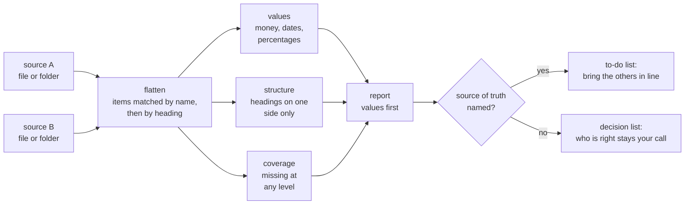

# spot-the-difference

**Find out where two versions of the same thing stopped agreeing.**

spot-the-difference is an [Agent Skill](https://platform.claude.com/docs/en/agents-and-tools/agent-skills/overview)
for Claude. Point it at two or more sets of documents and it reports what is
different: which numbers disagree, which sections exist in one and not the other,
and where wording has moved. Everything runs **on your own machine**. Nothing is
uploaded. Runs on a stock Mac or Linux shell.

## The problem it solves

You settle the wording. Then you start moving things around, reformatting,
restyling, re-rendering, porting it to another tool. By the time the layout is
final, the words are not the words you approved.

Some of those changes are obvious. Some are one digit in a price, or a section
that quietly stopped existing. Those are the ones that reach other people.

Checking by hand is tedious enough that it does not reliably happen. So it does
not get done, and the mismatch goes out to other people.

## Who this is for

- **Anyone who keeps the same content in two places.** A doc and its published
  page, a source file and its rendered output, a master copy and the versions
  that went out.
- **Writers and editors** who lock language early and want to prove it survived
  production.
- **Anyone maintaining docs alongside the thing they describe**, where the docs
  drift and nobody notices until someone follows them.

You do not need to know the file formats or write any config. You name the things
to compare, and the skill asks the rest.

## What you get

| You want… | You get… |
|---|---|
| To know if your approved copy survived the render | A directional list of what the render is missing or changed |
| To compare several versions with no clear winner | A neutral list of where they disagree, and who the odd one out is |
| To catch a number that changed when it should not have | Values reported first and separately, ahead of any wording noise |
| To check a change propagated everywhere | Every remaining place the old value still appears |
| To confirm retired wording is really gone | Every remaining place it still appears, by file and line |

## How it works

Four questions, then a report.

1. What am I comparing?
2. Is one of them the source of truth, or is there no winner?
3. What counts: values, structure, prose, or all of it?
4. What shape should the output take: inline in chat, a doc, or a sheet (CSV)?

Question 2 matters most. With a source of truth, every difference is a task:
bring the others in line. Without one, the same difference is a decision you have
to make. The skill will not guess which situation you are in.



## Two modes

**compare** answers "what is different across these sources?"

```bash
bash spot.sh compare --source draft=./docs --source published=./site --truth draft
```

**trace** answers "where does this still appear?"

```bash
bash spot.sh trace --source docs=./docs --term '$29' --loose
```

Use `trace` after a value changes, to check the change propagated. Use it again
when you have decided to stop saying something, to find the stragglers.

## The report

Four sections, in this order:

1. **Values.** Numbers, dates, money, percentages. Each class is extracted and
   then masked before the next runs, so a price is never shredded into stray
   digits. Reworded prose is usually deliberate. A changed number usually is not,
   which is why this section comes first.
2. **Structure.** Headings present in one matched item and not another.
3. **Missing.** Not found at any level, neither as a file nor as a heading. Kept
   separate from items that are merely stored at a different grain, because
   sources often disagree about granularity rather than content.
4. **Needs your eye.** Low confidence pairings and name collisions. Guesses are
   labelled as guesses.

## Install

This is an [Agent Skill](https://platform.claude.com/docs/en/agents-and-tools/agent-skills/overview),
so it works anywhere Skills do. Installs do not sync between surfaces; set it up
on each one you use.

**In Claude Code** (two commands, then just ask for a comparison):

```
/plugin marketplace add cabbagecachekid/spot-the-difference
/plugin install spot-the-difference@spot-the-difference
```

Or clone it and link the skill directly:

```bash
git clone https://github.com/cabbagecachekid/spot-the-difference.git
ln -s "$PWD/spot-the-difference/skills/spot-the-difference" ~/.claude/skills/spot-the-difference
```

**On claude.ai** (Pro plan or higher, with code execution enabled): download
this repository, zip the inner `skills/spot-the-difference` folder, and upload
that zip under Settings, in the Skills section. Then upload the document
versions you want compared into the chat, since claude.ai cannot see your disk.

**No Claude at all:** the script runs standalone in any Mac or Linux terminal:

```bash
bash spot.sh compare --source draft=./docs --source published=./site
```

## Formats and dependencies

There are no required dependencies. `.md`, `.txt`, and `.html` work out of the
box on a stock Mac.

Two optional tools are recommended for wider coverage: `.pdf` needs
[pdftotext](https://poppler.freedesktop.org/) and `.docx` needs
[pandoc](https://pandoc.org/).

```bash
brew install poppler pandoc
```

If they are missing, those files are skipped and the report says exactly how
many were skipped and why.

Any other file type is also counted and named, so pointing this at a folder of
mixed formats tells you what it could not read rather than quietly leaving it
out. Nothing is dropped silently.

Runs on a stock macOS shell (bash 3.2, BSD userland) and on GNU/Linux
(verified on Ubuntu 24.04), with no install step either way.

Outside Claude Code — in claude.ai chat, for instance — there is no local disk
for the skill to read, so upload the versions you want compared and it works on
the uploaded copies inside the session. Last-modified dates there describe the
upload, not your original files.

## What it will not do

It reports; it does not fix. It will not rewrite your files, sync one source to
another, or judge whether a wording change was an improvement. Deciding what to
do about a difference stays with you.

## License

MIT.
